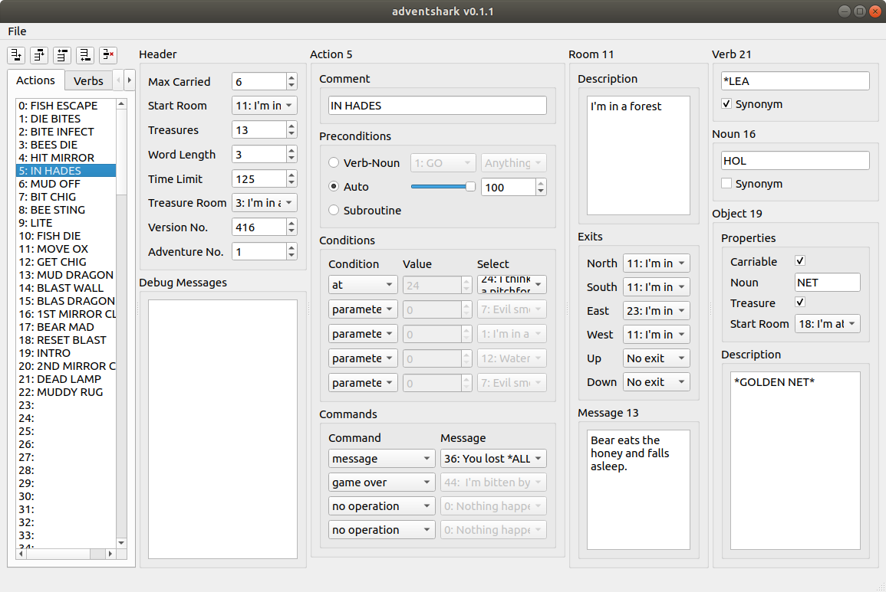

## adventshark



Adventshark is a free and open source cross-platform interactive fiction authoring tool that allows the creation of "Scott Adams compatible" files.

### Download

[Windows version v0.1.1](https://github.com/pdxiv/adventshark/releases/download/v0.1.1/adventshark_windows_v0.1.1.zip)

[MacOS version v0.1.1](https://github.com/pdxiv/adventshark/releases/download/v0.1.1/adventshark_macos_v0.1.1.zip)

[Linux version v0.1.1](https://github.com/pdxiv/adventshark/releases/download/v0.1.1/adventshark_linux_v0.1.1.zip)

For more details and to build the files yourself please refer to the [GitHub repository](https://github.com/pdxiv/adventshark).

### Documentation

Documentation is currently a work in process but there is some reference information on the [adventshark reference page](adventshark_reference.md).

There is also a short [demonstration game](https://github.com/pdxiv/adventshark/blob/master/demonstration_game.json) available.

### How to play the games

By using the "Export As" menu option, adventshark can generate files compatible with the Scott Adams/Adventure International game engine. Any "driver" program that allows you to play Scott Adams games can be used to run the games that have been created in adventshark. Some examples of programs are [PerlScott](https://github.com/pdxiv/PerlScott/releases/download/v1.0.0/perlscott.pl) and [ScottFree](https://www.ifarchive.org/indexes/if-archiveXscott-adamsXinterpretersXscottfree.html).

Please note, that adventshark can be used to produce data files that exceed limitations of some specific programs.

### How to convert .dat files to .json

Since adventshark currently doesn't have file import functionality, old "Scott Adams" data files from TRS-80 will first need to be converted to adventshark's `.json` format with an included Perl script: [scott2json.pl](https://github.com/pdxiv/adventshark/blob/master/scott2json.pl). (Requires Readonly.pm and JSON.pm, which in Ubuntu can be installed with `sudo apt install libjson-perl libreadonly-perl`) Some of the original adventure game files in `.dat` format can be obtained from [Scott Adams' web site](http://www.msadams.com/downloads.htm) directly.

#### Basic scott2json usage example (Linux/MacOSX)

```bash
./scott2json.pl adv01.dat > adv01.json
```

#### Usage example with many files at once (Linux/MacOSX)

This example assumes that the `rename` utility is installed. It will convert all the `.dat` files in the directory at once to `.json` format.

```bash
ls -1 *.dat | xargs -i bash -c "./scott2json.pl {} | python -m json.tool > {}.json" ; rename -f 's/.dat.json$/.json/' *.dat.json
```

### Support or Contact

Having trouble with adventshark? Found a bug that needs fixing? Check out the [GitHub repository](https://github.com/pdxiv/adventshark) and create an issue if you don't find what you need.
